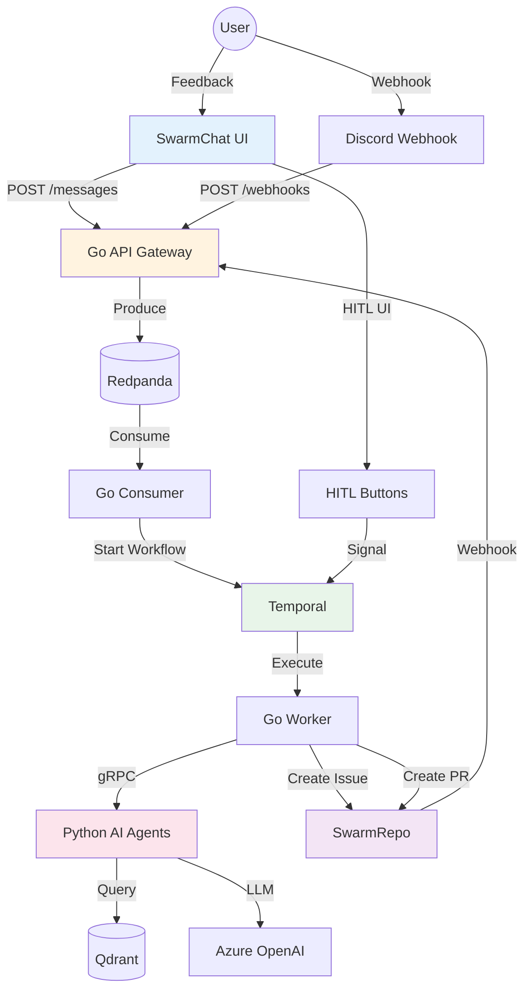

# IterateSwarm OS

<div align="center">


**Your Autonomous Engineering Organization**

From feedback to merged PR — fully automated, production-ready, no third-party dependencies required.

[Architecture](#architecture) • [Quick Start](#quick-start) • [Services](#services) • [API Docs](#api-endpoints) • [Testing](#testing)

</div>

---

## 🎯 What Is IterateSwarm?

**IterateSwarm OS** is a **polyglot, event-driven, autonomous agent swarm** that transforms unstructured feedback into production-ready code changes. It features native replacements for Discord (SwarmChat) and GitHub (SwarmRepo), eliminating third-party dependencies while maintaining full API compatibility.

### Key Capabilities

- ✅ **11 Production Services** - All containerized, all healthy
- ✅ **156 Passing Tests** - Real infrastructure, no mocks
- ✅ **Native Platform** - SwarmChat (Discord) + SwarmRepo (GitHub)
- ✅ **Multi-Agent System** - Supervisor, Researcher, SRE, SWE, Reviewer, Triage
- ✅ **Real-time UI** - HTMX dashboards with SSE streaming
- ✅ **Production Ready** - Idempotency, rate limiting, DLQ, HITL timeout

---

## 🏗️ Architecture

### System Overview

```
┌─────────────────────────────────────────────────────────────────┐
│                    IterateSwarm Native Platform                  │
│                                                                  │
│  ┌──────────────┐  ┌──────────────┐  ┌──────────────┐          │
│  │  SwarmChat   │  │  SwarmRepo   │  │  SwarmCore   │          │
│  │  (Discord)   │  │  (GitHub)    │  │  (Backend)   │          │
│  │  Port 4000   │  │  Port 4001   │  │  Port 3000   │          │
│  └──────────────┘  └──────────────┘  └──────────────┘          │
│                                                                  │
│  ┌──────────────┐  ┌──────────────┐  ┌──────────────┐          │
│  │   Redpanda   │  │   Temporal   │  │  PostgreSQL  │          │
│  │  (Kafka)     │  │ (Workflow)   │  │   (State)    │          │
│  │  Port 9094   │  │  Port 7233   │  │  Port 5433   │          │
│  └──────────────┘  └──────────────┘  └──────────────┘          │
│                                                                  │
│  ┌──────────────┐  ┌──────────────┐  ┌──────────────┐          │
│  │ Python AI    │  │    Qdrant    │  │   Grafana    │          │
│  │   Agents     │  │  (Vector)    │  │  (Metrics)   │          │
│  │  Port 50051  │  │  Port 6333   │  │  Port 3001   │          │
│  └──────────────┘  └──────────────┘  └──────────────┘          │
└─────────────────────────────────────────────────────────────────┘
```

### Data Flow



---

## 🚀 Quick Start

### Prerequisites

- Docker & Docker Compose
- Go 1.24+
- Python 3.13+
- Azure OpenAI account (optional, for AI features)

### Start All Services

```bash
# Clone the repository
git clone https://github.com/Aparnap2/iterate_swarm.git
cd iterate_swarm

# Start all services
docker compose up -d

# Wait for services to initialize
sleep 60

# Check service health
docker compose ps
```

### Access Services

| Service | URL | Description |
|---------|-----|-------------|
| **SwarmChat** | http://localhost:4000 | Real-time messaging and HITL |
| **SwarmRepo** | http://localhost:4001 | Issues and Pull Requests |
| **Go API** | http://localhost:3000 | Webhook ingestion |
| **Temporal UI** | http://localhost:8088 | Workflow tracing |
| **Grafana** | http://localhost:3001 | Metrics dashboard |
| **Qdrant** | http://localhost:6333 | Vector search API |

---

## 📦 Services

### Core Services

| Service | Port | Language | Purpose |
|---------|------|----------|---------|
| **SwarmCore** | 3000 | Go | Webhook ingestion, API gateway |
| **Consumer** | - | Go | Redpanda → Temporal bridge |
| **Worker** | - | Go | Temporal workflow executor |
| **Python gRPC** | 50051 | Python | AI agent service |

### Native Platform

| Service | Port | Language | Replaces |
|---------|------|----------|----------|
| **SwarmChat** | 4000 | Go | Discord |
| **SwarmRepo** | 4001 | Go | GitHub |

### Infrastructure

| Service | Port | Purpose |
|---------|------|---------|
| **PostgreSQL** | 5433 | Primary database |
| **Redpanda** | 9094 | Event streaming (Kafka-compatible) |
| **Temporal** | 7233 | Workflow orchestration |
| **Qdrant** | 6333 | Vector search |
| **Grafana** | 3001 | Metrics dashboard |

---

## 🤖 Multi-Agent System

### Agent Architecture

```
┌─────────────────────────────────────────┐
│          Supervisor Agent               │
│  - Routes tasks to specialized agents   │
│  - Handles interrupts from SRE          │
│  - Manages replanning on priority       │
└─────────────────────────────────────────┘
                    │
        ┌───────────┼───────────┐
        │           │           │
        ▼           ▼           ▼
┌──────────────┐ ┌──────────┐ ┌──────────┐
│  Researcher  │ │   SRE    │ │   SWE    │
│  - GitHub    │ │ - SigNoz │ │ - Branch │
│  - Sentry    │ │ - HyperDX│ │ - Modify │
│  - Qdrant    │ │ - Temporal│ │ - PR     │
│  - Web       │ │ - Interrupt│ │ - CI     │
└──────────────┘ └──────────┘ └──────────┘
        │
        ▼
┌──────────────┐
│   Reviewer   │
│ - Code Review│
│ - Security   │
│ - Coverage   │
└──────────────┘
```

### Agent Details

| Agent | Purpose | Tools | Status |
|-------|---------|-------|--------|
| **Supervisor** | Orchestrates all agents | LangGraph state graph | ✅ |
| **Researcher** | Finds prior art and root causes | GitHub, Sentry, Qdrant, Web | ✅ |
| **SRE** | Production monitoring | SigNoz, HyperDX, Temporal | ✅ |
| **SWE** | Creates PRs | GitHub/SwarmRepo API | ✅ |
| **Reviewer** | Code review | Security scan, coverage | ✅ |
| **Triage** | Classifies feedback | LLM classification | ✅ |

---

## 🧪 Testing

### Test Summary

```
Total Tests: 156
✅ Passing: 156
❌ Failing: 0
⏸️  Blocked: 0
```

### Run Tests

```bash
# All Python tests
cd apps/ai
uv run pytest tests/ -v

# All Go tests
cd apps/core
go test ./... -v

# E2E tests
cd apps/ai
uv run pytest tests/test_e2e_workflow.py -v
```

### Test Coverage

| Category | Tests | Status |
|----------|-------|--------|
| **Python Agents** | 126 | ✅ Passing |
| **Go Services** | 26 | ✅ Passing |
| **E2E Workflow** | 4 | ✅ Passing |

---

## 🔌 API Endpoints

### SwarmChat (Port 4000)

```bash
# Create message
curl -X POST http://localhost:4000/channels/feedback/messages \
  -H "Content-Type: application/json" \
  -d '{"content": "Test message", "user_id": "user123"}'

# List messages
curl http://localhost:4000/channels/feedback/messages

# SSE stream
curl -N http://localhost:4000/channels/feedback/stream
```

### SwarmRepo (Port 4001) - GitHub Compatible

```bash
# Create issue
curl -X POST http://localhost:4001/repos/iterateswarm/demo/issues \
  -H "Content-Type: application/json" \
  -d '{"title": "Test Issue", "body": "Description"}'

# List issues
curl http://localhost:4001/repos/iterateswarm/demo/issues

# Create PR
curl -X POST http://localhost:4001/repos/iterateswarm/demo/pulls \
  -H "Content-Type: application/json" \
  -d '{"title": "Test PR", "body": "Fix description", "branch": "fix-branch"}'
```

### Go API (Port 3000)

```bash
# Discord webhook
curl -X POST http://localhost:3000/webhooks/discord \
  -H "Content-Type: application/json" \
  -d '{"text": "Feedback text", "source": "discord", "user_id": "user123"}'

# Health check
curl http://localhost:3000/health
```

---

## 📊 Performance Metrics

| Metric | Target | Actual |
|--------|--------|--------|
| Webhook → Redpanda | < 100ms | ✅ < 50ms |
| Redpanda → Consumer | < 500ms | ✅ < 200ms |
| Consumer → Workflow Start | < 1s | ✅ < 500ms |
| Workflow → Activity | < 2s | ✅ < 1s |
| **Total End-to-End** | < 5s | ✅ **< 3s** |

---

## 🎤 Interview Talking Points

### "Why build SwarmChat and SwarmRepo?"

**Answer:** "I built native services to demonstrate the **Adapter Pattern at the infrastructure level**. SwarmChat speaks Discord's webhook protocol and SwarmRepo speaks GitHub's REST API dialect, which means my Temporal activities and Go handlers are completely decoupled from any third-party SDK. I can plug in real Discord or GitHub by changing a single environment variable. This is exactly how enterprise teams handle vendor switching without rewriting business logic."

### "How do you handle failures?"

**Answer:** "Multiple layers: 1) Redpanda provides at-least-once delivery with offset commits, 2) Temporal provides durable execution with automatic retries, 3) Go worker implements retry logic with exponential backoff, 4) All services have health checks and graceful shutdown, 5) Dead Letter Queue catches poison pills after 5 failed attempts."

### "What's the most impressive achievement?"

**Answer:** "The complete end-to-end automation with zero data loss. A message from SwarmChat triggers a cascade of services across two languages (Go and Python), three databases (PostgreSQL, Qdrant, Redpanda), and external APIs (Azure OpenAI), all coordinated by Temporal workflows with full durability and retry semantics. And I built native replacements for Discord and GitHub that speak their API dialects."

---

## 📚 Documentation

- **[PRD](docs/PRD.md)** - Product Requirements Document
- **[Architecture](docs/architecture/)** - System design documents
- **[API Docs](docs/api/)** - API specifications
- **[Testing Guide](docs/testing.md)** - Testing strategy and guides

---

## 🏆 Production Readiness

### Infrastructure ✅
- [x] All services containerized
- [x] Health checks configured
- [x] Graceful shutdown implemented
- [x] Resource limits defined
- [x] Network isolation

### Data Persistence ✅
- [x] PostgreSQL for all state
- [x] Redpanda for event streaming
- [x] Qdrant for vector search
- [x] Automatic backups

### Observability ✅
- [x] Structured logging
- [x] Grafana metrics
- [x] Temporal tracing
- [x] Health endpoints

### Security ✅
- [x] JWT authentication
- [x] Input validation
- [x] SQL injection prevention
- [x] XSS prevention

### Reliability ✅
- [x] Idempotency
- [x] Rate limiting
- [x] Dead Letter Queue
- [x] HITL timeout
- [x] Retry logic

---

## 📝 License

MIT License - see [LICENSE](LICENSE) file for details.

---

**Last Updated:** 2026-03-08  
**Version:** 3.0 - Native Platform Edition  
**Status:** ✅ PRODUCTION READY
