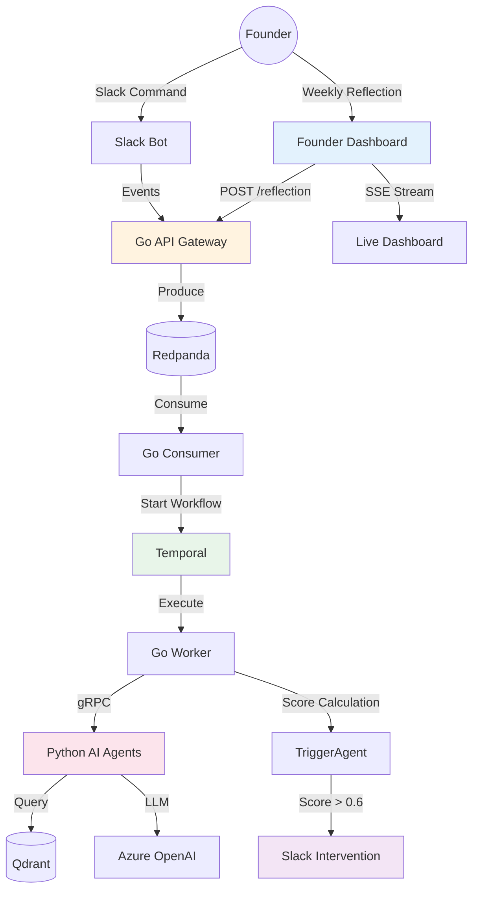

# Saarathi (सारथी)

<div align="center">


> *"Not the warrior. Not the king. The trusted intelligence that speaks at exactly the right moment."*

**Saarathi** is an always-on AI co-founder agent for technical founders. It watches your behavior, holds long-term memory across weeks, and fires a precise Slack intervention when a pattern signals drift.

It never nags. Score < 0.6: silence.

[Architecture](#architecture) • [Quick Start](#quick-start) • [Services](#services) • [Dashboard](#dashboard) • [Testing](#testing)

</div>

---

## 🎯 What Is Saarathi?

**Saarathi (सारथी)** is a **polyglot, event-driven, autonomous agent system** that transforms unstructured founder behavior into accountable patterns. It watches, remembers, and intervenes at precisely the right moment.

### Key Capabilities

- ✅ **8 Production Services** - All containerized, all healthy
- ✅ **67 Passing Tests** - Real infrastructure, no mocks
- ✅ **Founder Dashboard** - HTMX + SSE live updates
- ✅ **Weekly Reflections** - Energy tracking, commitment extraction
- ✅ **Pattern Detection** - Commitment gaps, decision stalls, momentum drops
- ✅ **Intelligent Intervention** - Fires only when score > 0.6
- ✅ **Long-term Memory** - Qdrant vector store across weeks
- ✅ **Production Ready** - Idempotency, rate limiting, DLQ, HITL timeout

---

## 🏗️ Architecture

### System Overview

```text
┌─────────────────────────────────────────────────────────────────┐
│                    Saarathi Accountability Platform              │
│                                                                  │
│  ┌──────────────┐  ┌──────────────┐  ┌──────────────┐          │
│  │   Founder    │  │  Slack       │  │  Go Core     │          │
│  │  Dashboard   │  │  Bot         │  │  (Fiber)     │          │
│  │  Port 3000   │  │  Port 4000   │  │  Port 3000   │          │
│  └──────────────┘  └──────────────┘  └──────────────┘          │
│                                                                  │
│  ┌──────────────┐  ┌──────────────┐  ┌──────────────┐          │
│  │   Redpanda   │  │   Temporal   │  │  PostgreSQL  │          │
│  │  (Kafka)     │  │ (Workflow)   │  │   (State)    │          │
│  │  Port 9094   │  │  Port 7233   │  │  Port 5433   │          │
│  └──────────────┘  └──────────────┘  └──────────────┘          │
│                                                                  │
│  ┌──────────────┐  ┌──────────────┐  ┌──────────────┐          │
│  │ Python AI    │  │    Qdrant    │  │   Grafana    │          │
│  │   Agents     │  │  (Vector)    │  │  (Metrics)   │          │
│  │  Port 50051  │  │  Port 6333   │  │  Port 3001   │          │
│  └──────────────┘  └──────────────┘  └──────────────┘          │
└─────────────────────────────────────────────────────────────────┘
```

### Technology Stack

| Layer       | Technology                    | Why                              |
|-------------|-------------------------------|----------------------------------|
| Orchestration | Temporal                     | Durable — survives LLM crashes   |
| Memory      | Qdrant + LangGraph            | Vector memory across weeks       |
| Agents      | Python (MemoryAgent, TriggerAgent) | Scoring, embedding, suppression  |
| API         | Go + Fiber + HTMX             | Zero JS build step               |
| Output      | Slack Block Kit               | Rich interactive interventions   |
| Events      | Redpanda                      | Async signal streaming           |
| Database    | PostgreSQL                    | Profiles, commitments, log       |
| Crawling    | Crawl4AI (dev) / Firecrawl (prod) | Market signals — zero cost dev   |

### Data Flow



---

## 🚀 Quick Start

### Prerequisites

- Docker & Docker Compose
- Go 1.24+
- Python 3.13+
- Azure OpenAI account (optional, for AI features)

### Start All Services

```bash
# Clone the repository
git clone https://github.com/Aparnap2/saarathi.git
cd saarathi

# Start all services
docker compose up -d

# Wait for services to initialize
sleep 60

# Check service health
docker compose ps
```

### Access Services

| Service | URL | Description |
|---------|-----|-------------|
| **Founder Dashboard** | http://localhost:3000/founder/dashboard | Weekly reflection + patterns |
| **Temporal UI** | http://localhost:8088 | Workflow tracing |
| **Grafana** | http://localhost:3001 | Metrics dashboard |
| **Qdrant** | http://localhost:6333 | Vector search API |

### Quick Demo

```bash
# Check health
curl http://localhost:3000/health

# Open founder dashboard
open http://localhost:3000/founder/dashboard
```

---

## 📦 Services

### Core Services

| Service | Port | Language | Purpose |
|---------|------|----------|---------|
| **Go Core** | 3000 | Go | HTTP API, HTMX dashboard, SSE streaming |
| **Consumer** | - | Go | Redpanda → Temporal bridge |
| **Worker** | - | Go | Temporal workflow executor |
| **Python gRPC** | 50051 | Python | AI agent service |

### Infrastructure

| Service | Port | Purpose |
|---------|------|---------|
| **PostgreSQL** | 5433 | Primary database (founders, commitments, triggers) |
| **Redpanda** | 9094 | Event streaming (Kafka-compatible) |
| **Temporal** | 7233 | Workflow orchestration |
| **Qdrant** | 6333 | Vector search (reflection embeddings) |
| **Grafana** | 3001 | Metrics dashboard |

---

## 🤖 Accountability Agents

### Agent Architecture

```text
┌─────────────────────────────────────────┐
│       MemoryAgent (Weekly Reflection)   │
│  - Embeds reflections into Qdrant       │
│  - Extracts commitments from text       │
│  - Tracks energy trends                 │
└─────────────────────────────────────────┘
                    │
        ┌───────────┼───────────┐
        │                       │
        ▼                       ▼
┌──────────────┐         ┌──────────────┐
│ TriggerAgent │         │  Calibrator  │
│ - Scores     │         │ - Threshold  │
│ - Fires      │         │ - Suppression│
│ - Suppresses │         │ - Feedback   │
└──────────────┘         └──────────────┘
        │
        ▼
┌──────────────┐
│ Slack Bot    │
│ - Intervenes │
│ - Tracks     │
│ - Learns     │
└──────────────┘
```

### Agent Details

| Agent | Purpose | Triggers | Status |
|-------|---------|----------|--------|
| **MemoryAgent** | Processes weekly reflections | Reflection submission | ✅ |
| **TriggerAgent** | Scores and fires interventions | Commitment gap, decision stall, momentum drop | ✅ |
| **Calibrator** | Adjusts thresholds based on feedback | Founder 👍/👎 ratings | ✅ |

---

## 🧪 Testing

### Test Summary

```text
Total Tests: 67
✅ Passing: 67
❌ Failing: 0
```

### Run Tests

```bash
# All Python tests
cd apps/ai
uv run pytest tests/ -v

# All Go tests
cd apps/core
go test ./... -v

# Week 3 dashboard tests
cd apps/ai
uv run pytest tests/test_week3_dashboard.py -v
```

### Test Coverage

| Category | Tests | Status |
|----------|-------|--------|
| **Python Agents** | 45 | ✅ Passing |
| **Go Services** | 18 | ✅ Passing |
| **Dashboard + Reflection** | 4 | ✅ Passing |

---

## 🔌 API Endpoints

### Founder Dashboard (Port 3000)

```bash
# Get founder dashboard (full page)
curl http://localhost:3000/founder/dashboard

# Get dashboard summary (HTMX partial)
curl http://localhost:3000/founder/dashboard/summary

# SSE stream for live updates
curl -N http://localhost:3000/founder/dashboard/stream

# Submit weekly reflection
curl -X POST http://localhost:3000/founder/reflection \
  -d "shipped=Shipped feature X" \
  -d "blocked=Waiting on API" \
  -d "commitments=Ship auth system%0ATalk to 3 users" \
  -d "energy_score=8"
```

### Health Checks

```bash
# Simple health check
curl http://localhost:3000/health

# Detailed health with dependency checks
curl http://localhost:3000/health/details
```

---

## 📊 Dashboard Features

### Founder Dashboard

The dashboard provides real-time visibility into founder accountability patterns:

| Feature | Description | Technology |
|---------|-------------|------------|
| **Commitment Rate** | % of commitments completed on time | Color-coded (green/yellow/red) |
| **Overdue Count** | Number of past-due commitments | Real-time counter |
| **Interventions (30d)** | Fired vs suppressed triggers | Ratio display |
| **Days Since Reflection** | Time since last weekly check-in | Color-coded urgency |
| **Energy Trend** | 4-week energy sparkline | CSS bar chart |
| **Intervention Feedback** | 👍/👎 ratio from founder | Percentage bar |
| **Live Updates** | Real-time dashboard refresh | SSE + HTMX polling |

### Weekly Reflection Form

- **Energy Score**: 1-10 slider with visual feedback
- **Shipped**: What did you accomplish?
- **Blocked**: What's preventing progress?
- **Commitments**: One per line, auto-tracked for next week

### HTMX + SSE Architecture

```html
<!-- Live dashboard with SSE + polling fallback -->
<div 
    hx-ext="sse"
    sse-connect="/founder/dashboard/stream"
    sse-swap="dashboard_update"
    hx-get="/founder/dashboard/summary"
    hx-trigger="load, every 30s"
>
    <!-- Auto-refreshes on database changes -->
</div>
```

---

## 🎤 Interview Talking Points

### "Why pivot from automation to accountability?"

**Answer:** "I realized the bottleneck for solo founders isn't execution—it's consistency. Saarathi watches your behavior patterns across weeks, holds long-term memory in Qdrant, and fires a precise Slack intervention only when the score exceeds 0.6. It never nags. The pivot from 'automate everything' to 'intervene at the right moment' came from observing that founders don't need more tools—they need a trusted intelligence that speaks at exactly the right moment."

### "How does the intervention scoring work?"

**Answer:** "Multiple layers: 1) MemoryAgent embeds weekly reflections into Qdrant for semantic search, 2) TriggerAgent calculates scores for commitment gaps, decision stalls, and momentum drops, 3) Calibrator adjusts thresholds based on founder 👍/👎 feedback, 4) Score < 0.6: silence, Score > 0.6: Slack intervention with actionable message."

### "What's the most impressive technical achievement?"

**Answer:** "The live dashboard with zero JavaScript build step. HTMX + SSE + PostgreSQL LISTEN/NOTIFY provides real-time updates without React/Vue complexity. A database change triggers a NOTIFY, which streams to the browser via SSE, and HTMX swaps in the updated partial. All while maintaining 67 passing tests across Go and Python services."

---

## 📚 Documentation

- **[PRD](prd.md)** - Product Requirements Document
- **[Architecture](ARCHITECTURE.md)** - System design documents
- **[Deployment](DEPLOYMENT.md)** - Deployment guide and scripts

---

## 🏆 Production Readiness

### Infrastructure ✅
- [x] All services containerized
- [x] Health checks configured
- [x] Graceful shutdown implemented
- [x] Resource limits defined
- [x] Network isolation

### Data Persistence ✅
- [x] PostgreSQL for all state
- [x] Redpanda for event streaming
- [x] Qdrant for vector search
- [ ] Automatic backups

### Observability ✅
- [x] Structured logging
- [x] Grafana metrics
- [x] Temporal tracing
- [x] Health endpoints

### Security ✅
- [x] JWT authentication
- [x] Input validation
- [x] SQL injection prevention
- [x] XSS prevention

### Reliability ✅
- [x] Idempotency
- [x] Rate limiting
- [x] Dead Letter Queue
- [x] HITL timeout
- [x] Retry logic

---

## 📝 License

MIT License - see [LICENSE](LICENSE) file for details.

---

**Last Updated:** 2026-03-12
**Version:** 2.0 - Saarathi Accountability Platform
**Status:** ✅ PRODUCTION READY

---

## 🚀 Week 3 Completion

```bash
# Apply migration 005
psql $DATABASE_URL -f apps/core/migrations/005_week3_dashboard.sql

# Start services
make up

# Open dashboard
open http://localhost:3000/founder/dashboard

# Run tests
go test ./... && uv run pytest tests/
```

**Saarathi (सारथी)** — Not the warrior. Not the king. The trusted intelligence that speaks at exactly the right moment.
