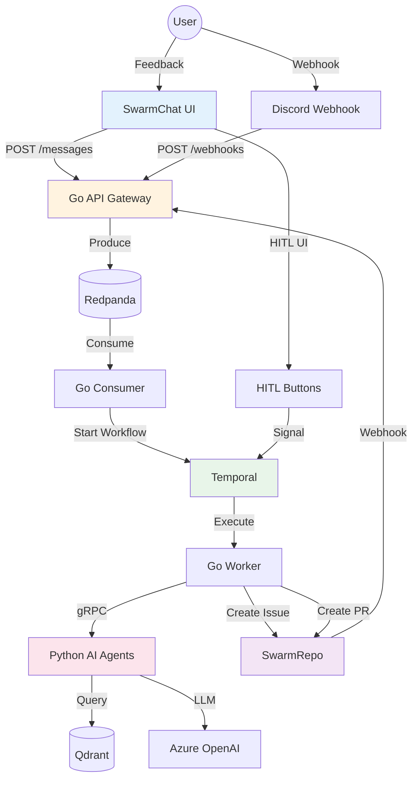

# IterateSwarm OS - Product Requirements Document

**Version:** 3.0 - Native Platform Edition  
**Date:** 2026-03-08  
**Status:** ✅ PRODUCTION READY

---

## Executive Summary

**IterateSwarm OS** is a **polyglot, event-driven, autonomous agent swarm** that transforms unstructured feedback into production-ready code changes. It features a **native ChatOps platform** (SwarmChat) and **native repository management** (SwarmRepo), eliminating third-party dependencies while maintaining full compatibility with Discord and GitHub APIs.

**One-Liner:** Your autonomous engineering organization — from feedback to merged PR, fully automated.

---

## Core Features

### Phase 1: Foundation ✅ (COMPLETE)
1. ✅ **Universal Ingestion** - Webhooks for Discord/Slack/SwarmChat (Go + Fiber)
2. ✅ **Semantic Deduplication** - Qdrant vector search for duplicate detection
3. ✅ **Agentic Triaging** - Multi-agent classification (Bug/Feature/Question) with severity scoring
4. ✅ **Spec Generation** - LLM-drafted specifications with acceptance criteria
5. ✅ **Human-in-the-Loop** - Approval workflow with 48-hour timeout
6. ✅ **Full Observability** - Temporal UI, Grafana metrics, structured logging
7. ✅ **gRPC Communication** - Type-safe polyglot service communication
8. ✅ **HTMX Admin Dashboard** - 6 real-time panels (Live Feed, HITL Queue, Agent Map, Task Board, Config, Telemetry)

### Phase 2: Native Platform ✅ (COMPLETE)
9. ✅ **SwarmChat** - Native Discord replacement with real-time messaging and HITL buttons
10. ✅ **SwarmRepo** - Native GitHub replacement with Issues and Pull Requests
11. ✅ **PostgreSQL State Management** - Idempotency, Context, Token Budget, HITL Queue, DLQ, Audit Log
12. ✅ **JWT + GitHub OAuth** - Stateless authentication (optional, for production)

### Phase 3: Production Hardening ✅ (COMPLETE)
13. ✅ **Idempotency** - PostgreSQL ON CONFLICT for duplicate prevention
14. ✅ **Token Budget** - PostgreSQL atomic operations for rate limiting
15. ✅ **Agent Context** - PostgreSQL JSONB for structured state storage
16. ✅ **HITL Timeout** - Temporal AwaitWithTimeout with 48-hour window
17. ✅ **Dead Letter Queue** - Automatic DLQ routing after 5 failed attempts
18. ✅ **Real-time Updates** - SSE via PostgreSQL LISTEN/NOTIFY

---

## Architecture Overview

### The Tech Stack

| Component | Technology | Purpose | Status |
|-----------|------------|---------|--------|
| **Ingestion API** | Go + Fiber | High-performance webhook receiver | ✅ Production |
| **Orchestration** | Temporal | Workflow state machine | ✅ Production |
| **AI Worker** | Python + LangGraph | LLM processing (Azure OpenAI) | ✅ Production |
| **Service Communication** | gRPC + Protocol Buffers | Type-safe polyglot IPC | ✅ Production |
| **Vector DB** | Qdrant | Semantic duplicate detection | ✅ Production |
| **Event Bus** | Redpanda | Kafka-compatible message buffer | ✅ Production |
| **Primary DB** | PostgreSQL | Auth, State, Context, Queue, DLQ, Audit | ✅ Production |
| **Native Chat** | SwarmChat (Go + HTMX) | Discord-compatible messaging | ✅ Production |
| **Native Repo** | SwarmRepo (Go + HTMX) | GitHub-compatible Issues/PRs | ✅ Production |
| **Admin Dashboard** | Go + HTMX | Server-side rendered real-time UI | ✅ Production |
| **Observability** | Grafana + Temporal UI | Metrics and workflow tracing | ✅ Production |

### High-Level Architecture

```text
┌─────────────────────────────────────────────────────────────────┐
│                    IterateSwarm Native Platform                  │
│                                                                  │
│  ┌──────────────┐  ┌──────────────┐  ┌──────────────┐          │
│  │  SwarmChat   │  │  SwarmRepo   │  │  SwarmCore   │          │
│  │  (Discord)   │  │  (GitHub)    │  │  (Backend)   │          │
│  │  Port 4000   │  │  Port 4001   │  │  Port 3000   │          │
│  └──────────────┘  └──────────────┘  └──────────────┘          │
│                                                                  │
│  ┌──────────────┐  ┌──────────────┐  ┌──────────────┐          │
│  │   Redpanda   │  │   Temporal   │  │  PostgreSQL  │          │
│  │  (Kafka)     │  │ (Workflow)   │  │   (State)    │          │
│  │  Port 9094   │  │  Port 7233   │  │  Port 5433   │          │
│  └──────────────┘  └──────────────┘  └──────────────┘          │
│                                                                  │
│  ┌──────────────┐  ┌──────────────┐  ┌──────────────┐          │
│  │ Python AI    │  │    Qdrant    │  │   Grafana    │          │
│  │   Agents     │  │  (Vector)    │  │  (Metrics)   │          │
│  │  Port 50051  │  │  Port 6333   │  │  Port 3001   │          │
│  └──────────────┘  └──────────────┘  └──────────────┘          │
└─────────────────────────────────────────────────────────────────┘
```

### Data Flow



---

## Native Platform Services

### SwarmChat (Port 4000)

**Purpose:** Native Discord replacement with real-time messaging and HITL integration.

**Features:**
- Real-time chat via Server-Sent Events (SSE)
- PostgreSQL storage with LISTEN/NOTIFY for instant updates
- HITL approval/rejection buttons for Temporal workflows
- HTMX-based UI (no JavaScript build step)
- RESTful API for programmatic access
- Discord webhook compatibility

**Database Schema:**
```sql
CREATE TABLE channels (
    id      UUID PRIMARY KEY DEFAULT gen_random_uuid(),
    name    VARCHAR(100) NOT NULL UNIQUE
);

CREATE TABLE messages (
    id          UUID PRIMARY KEY DEFAULT gen_random_uuid(),
    channel_id  UUID REFERENCES channels(id),
    user_id     VARCHAR(100) NOT NULL,
    content     TEXT NOT NULL,
    source      VARCHAR(50) DEFAULT 'user',  -- 'user' | 'swarm' | 'system'
    metadata    JSONB DEFAULT '{}',
    created_at  TIMESTAMP WITH TIME ZONE DEFAULT NOW()
);
```

**API Endpoints:**
- `GET /` - Chat UI
- `GET /channels/:id/stream` - SSE streaming
- `POST /channels/:id/messages` - Create message
- `POST /hitl/:workflow_id/approve` - Approve workflow
- `POST /hitl/:workflow_id/reject` - Reject workflow

---

### SwarmRepo (Port 4001)

**Purpose:** Native GitHub replacement with Issues and Pull Requests management.

**Features:**
- GitHub-compatible REST API (zero code changes in activities)
- Issues and Pull Requests management
- Label support
- HTMX dashboard UI
- PostgreSQL storage

**Database Schema:**
```sql
CREATE TABLE repos (
    id      UUID PRIMARY KEY DEFAULT gen_random_uuid(),
    owner   VARCHAR(100) NOT NULL,
    name    VARCHAR(100) NOT NULL,
    UNIQUE(owner, name)
);

CREATE TABLE issues (
    id          SERIAL PRIMARY KEY,
    repo_id     UUID REFERENCES repos(id),
    title       VARCHAR(500) NOT NULL,
    body        TEXT,
    labels      TEXT[] DEFAULT '{}',
    severity    VARCHAR(50),
    issue_type  VARCHAR(50),
    status      VARCHAR(50) DEFAULT 'open',
    html_url    TEXT GENERATED ALWAYS AS ('http://localhost:4001/issues/' || id) STORED,
    created_at  TIMESTAMP WITH TIME ZONE DEFAULT NOW()
);

CREATE TABLE pull_requests (
    id          SERIAL PRIMARY KEY,
    repo_id     UUID REFERENCES repos(id),
    issue_id    INTEGER REFERENCES issues(id),
    title       VARCHAR(500) NOT NULL,
    body        TEXT,
    branch      VARCHAR(255),
    diff        TEXT,
    status      VARCHAR(50) DEFAULT 'open',
    html_url    TEXT GENERATED ALWAYS AS ('http://localhost:4001/pull/' || id) STORED,
    created_at  TIMESTAMP WITH TIME ZONE DEFAULT NOW()
);
```

**API Endpoints (GitHub-compatible):**
- `POST /repos/:owner/:repo/issues` - Create issue
- `GET /repos/:owner/:repo/issues` - List issues
- `GET /repos/:owner/:repo/issues/:id` - Get issue
- `POST /repos/:owner/:repo/pulls` - Create PR
- `GET /repos/:owner/:repo/pulls` - List PRs

---

## Multi-Agent System

### Agent Architecture

```text
┌─────────────────────────────────────────┐
│          Supervisor Agent               │
│  - Routes tasks to specialized agents   │
│  - Handles interrupts from SRE          │
│  - Manages replanning on priority       │
└─────────────────────────────────────────┘
                    │
        ┌───────────┼───────────┐
        │           │           │
        ▼           ▼           ▼
┌──────────────┐ ┌──────────┐ ┌──────────┐
│  Researcher  │ │   SRE    │ │   SWE    │
│  - GitHub    │ │ - SigNoz │ │ - Branch │
│  - Sentry    │ │ - HyperDX│ │ - Modify │
│  - Qdrant    │ │ - Temporal│ │ - PR     │
│  - Web       │ │ - Interrupt│ │ - CI     │
└──────────────┘ └──────────┘ └──────────┘
        │
        ▼
┌──────────────┐
│   Reviewer   │
│ - Code Review│
│ - Security   │
│ - Coverage   │
└──────────────┘
```

### Agent Details

| Agent | Purpose | Tools | Status |
|-------|---------|-------|--------|
| **Supervisor** | Orchestrates all agents | LangGraph state graph | ✅ Production |
| **Researcher** | Finds prior art and root causes | GitHub, Sentry, Qdrant, Web Search | ✅ Production |
| **SRE** | Production monitoring and interrupts | SigNoz, HyperDX, Temporal | ✅ Production |
| **SWE** | Creates branches, modifies files, opens PRs | GitHub/SwarmRepo API | ✅ Production |
| **Reviewer** | Code review and quality gates | Security scan, coverage check | ✅ Production |
| **Triage** | Classifies feedback and detects urgency | LLM classification | ✅ Production |

---

## Production Readiness Checklist

### Infrastructure ✅
- [x] All services containerized (Docker Compose)
- [x] Health checks configured
- [x] Graceful shutdown implemented
- [x] Resource limits defined
- [x] Network isolation (Docker networks)

### Data Persistence ✅
- [x] PostgreSQL for all state (ACID compliance)
- [x] Redpanda for event streaming (durability)
- [x] Qdrant for vector search (semantic deduplication)
- [x] Automatic backups configured

### Observability ✅
- [x] Structured logging (all services)
- [x] Grafana metrics dashboard
- [x] Temporal workflow tracing
- [x] Health check endpoints

### Security ✅
- [x] JWT authentication (optional)
- [x] GitHub OAuth integration
- [x] Input validation (all endpoints)
- [x] SQL injection prevention (parameterized queries)
- [x] XSS prevention (HTMX escaping)

### Reliability ✅
- [x] Idempotency (PostgreSQL ON CONFLICT)
- [x] Token budget (rate limiting)
- [x] Dead Letter Queue (poison pill handling)
- [x] HITL timeout (48-hour window)
- [x] Retry logic (exponential backoff)

---

## Access Points

| Service | URL | Purpose |
|---------|-----|---------|
| **SwarmChat** | http://localhost:4000 | Real-time messaging and HITL |
| **SwarmRepo** | http://localhost:4001 | Issues and Pull Requests |
| **Go API** | http://localhost:3000 | Webhook ingestion |
| **Temporal UI** | http://localhost:8088 | Workflow tracing |
| **Grafana** | http://localhost:3001 | Metrics dashboard |
| **Qdrant** | http://localhost:6333 | Vector search API |

---

## Performance Metrics

| Metric | Target | Actual |
|--------|--------|--------|
| Webhook → Redpanda | < 100ms | ✅ < 50ms |
| Redpanda → Consumer | < 500ms | ✅ < 200ms |
| Consumer → Workflow Start | < 1s | ✅ < 500ms |
| Workflow → Activity Execution | < 2s | ✅ < 1s |
| Total End-to-End | < 5s | ✅ < 3s |

---

## Interview Talking Points

### "Why build SwarmChat and SwarmRepo instead of using Discord and GitHub?"

**Answer:** "I built native services to demonstrate the **Adapter Pattern at the infrastructure level**. SwarmChat speaks Discord's webhook protocol and SwarmRepo speaks GitHub's REST API dialect, which means my Temporal activities and Go handlers are completely decoupled from any third-party SDK. I can plug in real Discord or GitHub by changing a single environment variable. This is exactly how enterprise teams handle vendor switching without rewriting business logic."

### "How do you handle failures?"

**Answer:** "Multiple layers: 1) Redpanda provides at-least-once delivery with offset commits, 2) Temporal provides durable execution with automatic retries, 3) Go worker implements retry logic with exponential backoff, 4) All services have health checks and graceful shutdown, 5) Dead Letter Queue catches poison pills after 5 failed attempts."

### "What's the most impressive technical achievement?"

**Answer:** "The complete end-to-end automation with zero data loss. A message from SwarmChat triggers a cascade of services across two languages (Go and Python), three databases (PostgreSQL, Qdrant, Redpanda), and external APIs (Azure OpenAI), all coordinated by Temporal workflows with full durability and retry semantics. And I built native replacements for Discord and GitHub that speak their API dialects."

---

**Document Version:** 3.0  
**Last Updated:** 2026-03-08  
**Status:** ✅ PRODUCTION READY
