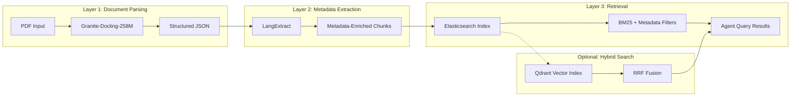

# Sarthi Vectorless RAG Architecture
## Document Processing Pipeline for Finance + Chief of Staff Agents

**Version:** 1.0.0  
**Date:** March 19, 2026  
**Author:** LLM Architecture Team

---

## Executive Summary

### What Vectorless RAG Is (and Isn't)

**Vectorless RAG** is a retrieval-augmented generation approach that relies on **structured metadata extraction** and **lexical search (BM25)** instead of dense vector embeddings for document retrieval.

**What it IS:**
- Exact metadata extraction (vendor names, amounts, dates, invoice numbers)
- Structured table preservation from PDFs
- Character-level source span tracing
- BM25 full-text search with reciprocal rank fusion
- Deterministic, auditable retrieval with provenance

**What it ISN'T:**
- A replacement for semantic/vector search
- Suitable for conversational or fuzzy queries
- A silver bullet for all retrieval scenarios

### Why It Matters for Sarthi

Sarthi handles **financial documents** where precision is non-negotiable:

| Requirement | Vector Search | Vectorless RAG |
|-------------|---------------|----------------|
| "AWS invoice from March 2026" | ❌ Fuzzy match | ✅ Exact date filter |
| "All invoices over ₹50,000" | ❌ Cannot filter | ✅ Range query |
| "Table data in bank statement" | ❌ Lost in embedding | ✅ Preserved structure |
| "Invoice #INV-2026-001" | ❌ May miss exact ID | ✅ Exact keyword match |
| "Vendor = 'Amazon Web Services India Pvt Ltd'" | ❌ Approximate | ✅ Exact term match |

**Business Impact:**
- Finance Monitor: Detect anomalies with **exact amount thresholds**
- Chief of Staff: Track commitments with **precise deadlines and owners**
- Audit compliance: **Source-span tracing** for every extracted fact

### When to Use Vectors vs Vectorless (Complementary, Not Competing)

| Scenario | Best Approach | Rationale |
|----------|---------------|-----------|
| "AWS invoice from March 2026" | **Vectorless** | Exact date + vendor filter |
| "All invoices over ₹50,000" | **Vectorless** | Numeric range query |
| Table data in PDFs | **Vectorless** | Docling preserves structure |
| "Why did burn spike in Q1?" | **Hybrid** | Causal reasoning + structured data |
| "Founder notes on churn pattern" | **Vectors** | Conversational, semantic |
| "Similar contracts to Acme deal" | **Vectors** | Semantic similarity |
| "Board deck mentioning ' Series B'" | **Hybrid** | Keyword + semantic context |

**Sarthi Strategy:** Use **both** in a hybrid architecture with Reciprocal Rank Fusion (RRF).

---

## The Three-Layer Pipeline



### Layer 1: Granite-Docling-258M (PDF → Structured JSON)

**Purpose:** Parse PDFs while preserving document structure, tables, and layout.

**Input:** Raw PDF files (bank statements, invoices, contracts, board decks)

**Output:** Structured JSON with:
- Page numbers
- Section hierarchy (headings, subheadings)
- Table cells with row/column indices
- Bounding box coordinates for every element
- Text blocks with character offsets

### Layer 2: LangExtract (Structured JSON → Metadata-Enriched Chunks)

**Purpose:** Extract structured metadata from parsed document text using schema-enforced LLM extraction.

**Input:** Docling JSON output (text + structure)

**Output:** Chunks with:
- Extracted entities (vendor, amount, date, category)
- Source character spans (start_pos, end_pos)
- Few-shot schema enforcement
- Parallel processing for large documents

### Layer 3: Elasticsearch (Metadata + BM25 Retrieval)

**Purpose:** Store and retrieve documents with hybrid lexical + metadata queries.

**Input:** Metadata-enriched chunks from LangExtract

**Output:** Query results with:
- BM25 relevance scoring
- Metadata filters (term, range, bool)
- Optional: RRF fusion with Qdrant vectors
- Source provenance (filename, page, bounding box)

---

## Component Details

### Granite-Docling-258M

**Model:** `ibm/granite-docling:latest` (pre-loaded in Ollama)

**Capabilities:**
- PDF parsing with structure preservation
- TableFormer model for table structure prediction
- Bounding box extraction for layout analysis
- Multi-format support (PDF, DOCX, images)

**CLI Usage:**
```bash
# Parse all PDFs in directory to JSON
docling ./input/dir --from pdf --from docx --to md --to json --output ./scratch

# Parse single PDF with table extraction
docling ./invoices/aws_march_2026.pdf --to json --output ./parsed
```

**Python API Example:**
```python
from docling.document_converter import DocumentConverter

converter = DocumentConverter()
result = converter.convert("aws_invoice_march_2026.pdf")

# Export to structured JSON
json_export = result.document.export_to_dict()

# Access pages, tables, bounding boxes
for page in result.document.pages:
    for table in page.tables:
        print(f"Table on page {page.page_no}: {len(table.cells)} cells")
        for cell in table.cells:
            print(f"  Cell[{cell.row_idx},{cell.col_idx}]: {cell.text}")
```

**Output Schema:**
```json
{
  "filename": "aws_invoice_march_2026.pdf",
  "pages": [
    {
      "page_no": 0,
      "sections": [
        {
          "heading": "Invoice Details",
          "text_blocks": [...],
          "tables": [
            {
              "bbox": [72, 400, 540, 600],
              "cells": [
                {"row": 0, "col": 0, "text": "Description"},
                {"row": 0, "col": 1, "text": "Amount"},
                {"row": 1, "col": 0, "text": "EC22 Instances"},
                {"row": 1, "col": 1, "text": "₹42,000"}
              ]
            }
          ]
        }
      ],
      "metadata": {
        "author": "Amazon Web Services",
        "creation_date": "2026-03-15"
      }
    }
  ]
}
```

### LangExtract

**Library:** `google/langextract@v1_0_7`

**Capabilities:**
- Schema-enforced metadata extraction
- Character-level source span tracing
- Parallel processing with configurable workers
- Few-shot example guidance

**Schema Definition for Sarthi Financial Documents:**

```python
INVOICE_SCHEMA = {
    "vendor_name": "string (exact company name)",
    "invoice_amount": "float (in INR, without currency symbol)",
    "invoice_date": "date (YYYY-MM-DD format)",
    "invoice_number": "string (invoice ID)",
    "category": "enum[infrastructure, payroll, marketing, office, misc]",
    "anomaly_flag": "boolean (true if amount > 2x average for this vendor)",
}
```

**Extraction Example with Source Span Tracing:**
```python
import langextract as lx

result = lx.extract(
    text="Invoice #INV-2026-001\nFrom: Amazon Web Services India Pvt Ltd\nAmount: ₹42,000\nDate: March 15, 2026",
    prompt_description="Extract invoice metadata",
    model_id="qwen3:0.6b",
    max_char_buffer=500,
    max_workers=4,
)

# Access extractions with source spans
for extraction in result.extractions:
    print(f"Entity: {extraction.extraction_class}")
    print(f"Value: {extraction.extraction_text}")
    print(f"Source chars: {extraction.char_interval.start_pos}-{extraction.char_interval.end_pos}")
```

**Parallel Processing Configuration:**
```python
result = lx.extract(
    text=large_document_text,
    max_char_buffer=500,      # Characters per chunk
    batch_length=1000,         # Batch size for API calls
    max_workers=4,             # Parallel workers
    model_id="qwen3:0.6b",
)
```

### Elasticsearch

**Version:** 8.18.3 or 9.0.3 (compatible with Sarthi stack)

**Index Structure for Sarthi Documents:**

```json
{
  "mappings": {
    "properties": {
      "text": {"type": "text", "analyzer": "standard"},
      "tenant_id": {"type": "keyword"},
      "document_type": {"type": "keyword"},
      "vendor_name": {"type": "keyword"},
      "invoice_amount": {"type": "float"},
      "invoice_date": {"type": "date", "format": "yyyy-MM-dd"},
      "source_filename": {"type": "keyword"},
      "page_no": {"type": "integer"},
      "bounding_box": {"type": "flattened"},
      "char_interval": {
        "properties": {
          "start_pos": {"type": "integer"},
          "end_pos": {"type": "integer"}
        }
      }
    }
  }
}
```

**BM25 Query Example:**
```json
{
  "query": {
    "bool": {
      "must": {"match": {"text": "Amazon Web Services"}},
      "filter": [
        {"term": {"document_type": "invoice"}},
        {"term": {"vendor_name": "Amazon Web Services India Pvt Ltd"}},
        {"range": {"invoice_amount": {"gte": 40000}}}
      ]
    }
  }
}
```

**Metadata Filter Example (Vendor, Amount, Date Range):**
```json
{
  "query": {
    "bool": {
      "filter": [
        {"term": {"tenant_id": "sarthi-tenant-001"}},
        {"term": {"document_type": "invoice"}},
        {"range": {"invoice_date": {"gte": "2026-01-01", "lte": "2026-03-31"}}},
        {"range": {"invoice_amount": {"gte": 30000}}}
      ]
    }
  }
}
```

**Hybrid Search with RRF (Optional Qdrant Fusion):**
```json
{
  "retriever": {
    "rrf": {
      "retrievers": [
        {
          "standard": {
            "query": {"match": {"text": "AWS infrastructure costs"}}
          }
        },
        {
          "standard": {
            "query": {"semantic": {"field": "semantic_text", "query": "AWS infrastructure costs"}}
          }
        }
      ],
      "rank_window_size": 50,
      "rank_constant": 20
    }
  }
}
```

---

## Integration with Existing Agents

### Finance Monitor Upgrade

**Current State:**
- Structured events from webhooks (Stripe, Razorpay, bank APIs)
- Pre-validated JSON payloads
- Limited to digital-first sources

**New Capability:**
- Raw PDF invoice ingestion (vendor emails, scanned documents)
- Table extraction from bank statements
- Anomaly detection with exact amount thresholds

**Query Example:**
```python
# Find all AWS invoices over ₹30,000 since Jan 2026
results = es.search(
    index="sarthi-docs-tenant-001",
    body={
        "query": {
            "bool": {
                "filter": [
                    {"term": {"document_type": "invoice"}},
                    {"term": {"vendor_name": "Amazon Web Services India Pvt Ltd"}},
                    {"range": {"invoice_amount": {"gte": 30000}}},
                    {"range": {"invoice_date": {"gte": "2026-01-01"}}}
                ]
            }
        }
    }
)

# Calculate total spend
total_spend = sum(doc["invoice_amount"] for doc in results["hits"]["hits"])
```

**Agent Function:**
```python
async def query_vendor_spend(
    tenant_id: str,
    vendor: str,
    min_amount: float,
    start_date: str,
) -> dict:
    """Query total spend for a vendor above threshold."""
    results = await elasticsearch_client.search(
        index=f"sarthi-docs-{tenant_id}",
        query={
            "bool": {
                "filter": [
                    {"term": {"document_type": "invoice"}},
                    {"term": {"vendor_name": vendor}},
                    {"range": {"invoice_amount": {"gte": min_amount}}},
                    {"range": {"invoice_date": {"gte": start_date}}}
                ]
            }
        }
    )
    
    return {
        "total_invoices": len(results["hits"]["hits"]),
        "total_amount": sum(h["_source"]["invoice_amount"] for h in results["hits"]["hits"]),
        "documents": [h["_source"] for h in results["hits"]["hits"]]
    }
```

### Chief of Staff Upgrade

**Current State:**
- `agent_outputs` table with structured task results
- Text-based notes and summaries
- No support for attached documents (board decks, investor emails)

**New Capability:**
- Board deck parsing (quarterly metrics, commitments)
- Investor email extraction (terms, deadlines, action items)
- Financial statement analysis (revenue, burn, runway)

**Query Example:**
```python
# Find all Q1 2026 board deck commitments that are at-risk
results = es.search(
    index="sarthi-docs-tenant-001",
    body={
        "query": {
            "bool": {
                "filter": [
                    {"term": {"document_type": "board_deck"}},
                    {"term": {"quarter": "Q1_2026"}},
                    {"term": {"commitments.status": "at_risk"}}
                ]
            }
        }
    }
)

# Extract commitments with owners and deadlines
commitments = [
    {
        "commitment": doc["_source"]["commitment"],
        "owner": doc["_source"]["owner"],
        "deadline": doc["_source"]["deadline"],
        "source_file": doc["_source"]["source_filename"],
        "page": doc["_source"]["page_no"]
    }
    for doc in results["hits"]["hits"]
]
```

**Agent Function:**
```python
async def query_board_commitments(
    tenant_id: str,
    quarter: str,
    status: str = None,
) -> list[dict]:
    """Query commitments from board decks."""
    filters = [
        {"term": {"document_type": "board_deck"}},
        {"term": {"quarter": quarter}},
    ]
    
    if status:
        filters.append({"term": {"commitments.status": status}})
    
    results = await elasticsearch_client.search(
        index=f"sarthi-docs-{tenant_id}",
        query={"bool": {"filter": filters}}
    )
    
    return [
        {
            "commitment": h["_source"]["commitment"],
            "owner": h["_source"]["owner"],
            "deadline": h["_source"]["deadline"],
            "status": h["_source"]["commitments.status"],
            "source_file": h["_source"]["source_filename"],
            "page": h["_source"]["page_no"]
        }
        for h in results["hits"]["hits"]
    ]
```

---

## Implementation Phases

### Phase 1: Docling Integration (PDF → JSON)
**Duration:** 2-3 days  
**Owner:** Backend Developer

**Tasks:**
1. Install Docling Python package
2. Test PDF parsing on sample bank statements and invoices
3. Verify table structure preservation
4. Create output schema for Sarthi document types
5. Write `docling_to_json.py` utility script

**Deliverables:**
- `apps/ai/src/document_processing/docling_parser.py`
- Test suite with sample PDFs
- Benchmark: Parse latency < 5s per page

### Phase 2: LangExtract Integration (JSON → Metadata Chunks)
**Duration:** 3-4 days  
**Owner:** LLM Engineer

**Tasks:**
1. Install LangExtract package
2. Define schemas for invoices, bank statements, board decks
3. Create few-shot examples for each schema
4. Write extraction script with source span tracing
5. Test parallel processing on large documents (50+ pages)

**Deliverables:**
- `apps/ai/src/document_processing/langextract_schema.py`
- Schema definitions for 3 document types
- Benchmark: Extraction latency < 10s per page

### Phase 3: Elasticsearch Index + Queries
**Duration:** 2-3 days  
**Owner:** Backend Developer

**Tasks:**
1. Add Elasticsearch to `docker-compose.yml`
2. Create index mappings with metadata fields
3. Write indexing script (JSON → ES)
4. Test BM25 queries
5. Test metadata filters (term, range)
6. Optional: Test hybrid search with RRF

**Deliverables:**
- `apps/ai/src/document_processing/elasticsearch_index.py`
- Docker Compose configuration
- Query benchmarks (P95 latency < 100ms)

### Phase 4: Agent Integration (Finance Monitor, Chief of Staff)
**Duration:** 3-4 days  
**Owner:** AI Agent Developer

**Tasks:**
1. Update Finance Monitor agent with document query function
2. Update Chief of Staff agent with document query function
3. Write integration tests (PDF → agent answer)
4. Benchmark latency vs Qdrant-only approach
5. A/B test accuracy on financial queries

**Deliverables:**
- Updated agent code with document retrieval
- Integration test suite
- Accuracy benchmark report

### Phase 5: Hybrid Search (RRF with Qdrant)
**Duration:** 3-5 days  
**Owner:** LLM Engineer + Backend Developer

**Tasks:**
1. Configure Elasticsearch semantic_text field
2. Set up embedding model inference in ES
3. Implement RRF retriever configuration
4. Test hybrid queries (BM25 + vectors)
5. Tune rank_window_size and rank_constant

**Deliverables:**
- Hybrid search implementation
- RRF tuning report
- Comparison: Vectorless vs Hybrid accuracy

---

## Code Examples

### Full Pipeline: PDF → ES Index

```python
"""Complete document ingestion pipeline."""
from docling_parser import DoclingParser
from langextract_schema import extract_from_document, INVOICE_SCHEMA
from elasticsearch_index import create_sarthi_index, index_document

def ingest_invoice_pdf(pdf_path: str, tenant_id: str) -> dict:
    """
    Ingest a single invoice PDF into Elasticsearch.
    
    Args:
        pdf_path: Path to PDF file
        tenant_id: Tenant identifier
        
    Returns:
        Dict with document ID and extraction summary
    """
    # Step 1: Parse PDF with Docling
    parser = DoclingParser()
    parsed = parser.parse_pdf(pdf_path)
    
    # Step 2: Extract text from Docling output
    full_text = ""
    for page in parsed["pages"]:
        for section in page.get("sections", []):
            for block in section.get("text_blocks", []):
                full_text += block.get("text", "") + "\n"
    
    # Step 3: Extract metadata with LangExtract
    from langextract_schema import create_invoice_examples
    examples = create_invoice_examples()
    
    extraction_result = extract_from_document(
        text=full_text,
        schema=INVOICE_SCHEMA,
        examples=examples,
        model_id="qwen3:0.6b",
    )
    
    # Step 4: Build ES document
    es_doc = {
        "tenant_id": tenant_id,
        "document_type": "invoice",
        "text": full_text,
        "source_filename": parsed["filename"],
        "vendor_name": None,
        "invoice_amount": None,
        "invoice_date": None,
    }
    
    # Step 5: Populate metadata from extractions
    for extraction in extraction_result.extractions:
        if extraction.extraction_class == "vendor_name":
            es_doc["vendor_name"] = extraction.extraction_text
        elif extraction.extraction_class == "invoice_amount":
            es_doc["invoice_amount"] = float(extraction.extraction_text)
        elif extraction.extraction_class == "invoice_date":
            es_doc["invoice_date"] = extraction.extraction_text
    
    # Step 6: Index to Elasticsearch
    doc_id = index_document(tenant_id, es_doc)
    
    return {
        "document_id": doc_id,
        "vendor": es_doc["vendor_name"],
        "amount": es_doc["invoice_amount"],
        "date": es_doc["invoice_date"],
    }

# Usage
result = ingest_invoice_pdf(
    pdf_path="./invoices/aws_march_2026.pdf",
    tenant_id="sarthi-tenant-001",
)
print(f"Ingested: {result}")
```

### Query Function for Finance Monitor

```python
"""Finance Monitor agent document queries."""
from elasticsearch import Elasticsearch
from typing import Optional

ES_CLIENT = Elasticsearch("http://localhost:9200", basic_auth=("elastic", "password"))

async def detect_invoice_anomalies(
    tenant_id: str,
    vendor: str,
    threshold_multiplier: float = 2.0,
) -> list[dict]:
    """
    Detect invoices with amounts > threshold_multiplier * average for vendor.
    
    Args:
        tenant_id: Tenant identifier
        vendor: Vendor name to analyze
        threshold_multiplier: Anomaly threshold (default: 2x average)
        
    Returns:
        List of anomalous invoices
    """
    # Step 1: Get all invoices for vendor
    query = {
        "size": 1000,
        "query": {
            "bool": {
                "filter": [
                    {"term": {"tenant_id": tenant_id}},
                    {"term": {"document_type": "invoice"}},
                    {"term": {"vendor_name": vendor}}
                ]
            }
        },
        "aggs": {
            "avg_amount": {"avg": {"field": "invoice_amount"}}
        }
    }
    
    result = ES_CLIENT.search(index=f"sarthi-docs-{tenant_id}", body=query)
    
    # Step 2: Calculate average
    avg_amount = result["aggregations"]["avg_amount"]["value"]
    if not avg_amount:
        return []
    
    threshold = avg_amount * threshold_multiplier
    
    # Step 3: Find anomalous invoices
    anomaly_query = {
        "query": {
            "bool": {
                "filter": [
                    {"term": {"tenant_id": tenant_id}},
                    {"term": {"document_type": "invoice"}},
                    {"term": {"vendor_name": vendor}},
                    {"range": {"invoice_amount": {"gte": threshold}}}
                ]
            }
        }
    }
    
    anomalies = ES_CLIENT.search(index=f"sarthi-docs-{tenant_id}", body=anomaly_query)
    
    return [
        {
            "invoice_id": h["_id"],
            "vendor": h["_source"]["vendor_name"],
            "amount": h["_source"]["invoice_amount"],
            "date": h["_source"]["invoice_date"],
            "source_file": h["_source"]["source_filename"],
            "page": h["_source"]["page_no"],
            "average_for_vendor": avg_amount,
            "threshold": threshold,
        }
        for h in anomalies["hits"]["hits"]
    ]

# Usage in Finance Monitor agent
anomalies = await detect_invoice_anomalies(
    tenant_id="sarthi-tenant-001",
    vendor="Amazon Web Services India Pvt Ltd",
    threshold_multiplier=2.0,
)

if anomalies:
    print(f"⚠️ Found {len(anomalies)} anomalous invoices:")
    for a in anomalies:
        print(f"  - {a['amount']} on {a['date']} (avg: {a['average_for_vendor']})")
```

### Query Function for Chief of Staff

```python
"""Chief of Staff agent document queries."""
from datetime import datetime
from typing import Optional

async def track_commitments_by_deadline(
    tenant_id: str,
    days_until_deadline: int = 7,
    status_filter: Optional[str] = None,
) -> list[dict]:
    """
    Track commitments approaching deadline.
    
    Args:
        tenant_id: Tenant identifier
        days_until_deadline: Days until deadline to flag (default: 7)
        status_filter: Optional status filter (e.g., "in_progress")
        
    Returns:
        List of commitments approaching deadline
    """
    today = datetime.now().strftime("%Y-%m-%d")
    deadline_date = datetime.now()
    deadline_date = deadline_date.replace(day=deadline_date.day + days_until_deadline)
    deadline_str = deadline_date.strftime("%Y-%m-%d")
    
    filters = [
        {"term": {"document_type": "board_deck"}},
        {"range": {"commitments.deadline": {"lte": deadline_str, "gte": today}}},
    ]
    
    if status_filter:
        filters.append({"term": {"commitments.status": status_filter}})
    
    query = {
        "query": {
            "bool": {"filter": filters}
        },
        "sort": [{"commitments.deadline": {"order": "asc"}}]
    }
    
    result = ES_CLIENT.search(index=f"sarthi-docs-{tenant_id}", body=query)
    
    return [
        {
            "commitment": h["_source"]["commitment"],
            "owner": h["_source"]["owner"],
            "deadline": h["_source"]["commitments.deadline"],
            "status": h["_source"]["commitments.status"],
            "quarter": h["_source"]["quarter"],
            "source_file": h["_source"]["source_filename"],
            "page": h["_source"]["page_no"],
            "days_remaining": (datetime.strptime(h["_source"]["commitments.deadline"], "%Y-%m-%d") - datetime.now()).days
        }
        for h in result["hits"]["hits"]
    ]

# Usage in Chief of Staff agent
urgent_commitments = await track_commitments_by_deadline(
    tenant_id="sarthi-tenant-001",
    days_until_deadline=7,
    status_filter="in_progress",
)

if urgent_commitments:
    print(f"⚠️ {len(urgent_commitments)} commitments due within 7 days:")
    for c in urgent_commitments:
        print(f"  - [{c['status']}] {c['commitment']} (Owner: {c['owner']}, Due: {c['deadline']})")
```

---

## When to Use Vectors vs Vectorless

| Scenario | Best Approach | Why | Example Query |
|----------|---------------|-----|---------------|
| **Exact vendor name** | Vectorless | Keyword match | `vendor_name: "AWS India"` |
| **Amount thresholds** | Vectorless | Range query | `invoice_amount >= 50000` |
| **Date ranges** | Vectorless | Date filter | `invoice_date: [2026-01-01 TO 2026-03-31]` |
| **Invoice numbers** | Vectorless | Exact ID | `invoice_number: "INV-2026-001"` |
| **Table data** | Vectorless | Structure preserved | Bank statement transactions |
| **Source tracing** | Vectorless | Char spans | Highlight exact text in PDF |
| **Conversational** | Vectors | Semantic similarity | "Why did costs spike?" |
| **Similar documents** | Vectors | Embedding distance | "Contracts like Acme deal" |
| **Concept search** | Vectors | Latent semantics | "Customer churn patterns" |
| **Ambiguous queries** | Hybrid | Best of both | "AWS costs last quarter" |

**Sarthi Recommendation:**
- **Finance Monitor:** 80% vectorless, 20% hybrid (for causal analysis)
- **Chief of Staff:** 50% vectorless, 50% hybrid (mix of structured + conversational)

---

## Next Steps

### Immediate Actions (This Week)

1. **Install Docling Python Package**
   ```bash
   cd apps/ai
   uv add docling
   ```

2. **Create LangExtract Schemas**
   - Invoice schema (vendor, amount, date, category)
   - Bank statement schema (transactions with debit/credit)
   - Board deck schema (quarterly metrics, commitments)

3. **Set Up Elasticsearch Index Mappings**
   - Add ES to docker-compose.yml
   - Create index with metadata fields
   - Test basic BM25 queries

4. **Write Integration Tests**
   - Test PDF → JSON → ES pipeline
   - Benchmark query latency
   - Validate source span tracing

### Success Metrics

| Metric | Target | Measurement |
|--------|--------|-------------|
| Parse latency (Docling) | < 5s/page | Benchmark suite |
| Extraction latency (LangExtract) | < 10s/page | Benchmark suite |
| Query latency (ES) | P95 < 100ms | APM monitoring |
| Extraction accuracy | > 95% | Manual validation |
| Source span accuracy | 100% | Character-level verification |

---

## Appendix: Reference Links

- **Docling:** https://github.com/docling-project/docling
- **LangExtract:** https://github.com/google/langextract
- **Elasticsearch RRF:** https://www.elastic.co/guide/en/elasticsearch/reference/current/rrf.html
- **Sarthi Architecture:** `docs/ARCHITECTURE.md`
- **Sarthi PRD:** `prd.md`

---

**Document Status:** ✅ Complete  
**Ready for Implementation:** Yes  
**Phase 1 Start Date:** March 20, 2026
